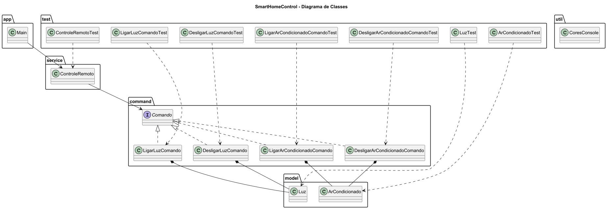

# SmartHomeControl

Sistema de automação residencial desenvolvido em Java utilizando o padrão de projeto Command.

O projeto simula um cenário comum do cotidiano em que um controle remoto é capaz de executar comandos sobre dispositivos inteligentes de uma residência, desacoplando quem solicita a ação de quem realmente a executa.

---

# Padrão de Projeto Utilizado

## Command

O padrão comportamental Command encapsula solicitações como objetos, permitindo parametrizar clientes com diferentes operações.

### Estrutura do padrão no projeto

| Papel | Classe |
|---------|---------|
| Command | Comando |
| ConcreteCommand | LigarLuzComando |
| ConcreteCommand | DesligarLuzComando |
| ConcreteCommand | LigarArCondicionadoComando |
| ConcreteCommand | DesligarArCondicionadoComando |
| Receiver | Luz |
| Receiver | ArCondicionado |
| Invoker | ControleRemoto |
| Client | Main |

---

# Diagrama de Classes



---

# Funcionalidades

- Ligar luz
- Desligar luz
- Ligar ar-condicionado
- Desligar ar-condicionado
- Controle remoto genérico
- Encapsulamento de ações em comandos
- Execução desacoplada de operações

---

# Estrutura do Projeto

```text
padrao-command/
│
├── src/
│   ├── main/
│   │   ├── app/
│   │   │   └── Main.java
│   │   │
│   │   ├── command/
│   │   │   ├── Comando.java
│   │   │   ├── LigarLuzComando.java
│   │   │   ├── DesligarLuzComando.java
│   │   │   ├── LigarArCondicionadoComando.java
│   │   │   └── DesligarArCondicionadoComando.java
│   │   │
│   │   ├── model/
│   │   │   ├── Luz.java
│   │   │   └── ArCondicionado.java
│   │   │
│   │   ├── service/
│   │   │   └── ControleRemoto.java
│   │   │
│   │   └── util/
│   │       └── CoresConsole.java
│   │
│   └── test/
│       ├── LuzTest.java
│       ├── ArCondicionadoTest.java
│       ├── ControleRemotoTest.java
│       ├── LigarLuzComandoTest.java
│       ├── DesligarLuzComandoTest.java
│       ├── LigarArCondicionadoComandoTest.java
│       └── DesligarArCondicionadoComandoTest.java
│
├── docs/
│   └── diagrama-classe.png
│
├── README.md
│
└── .gitignore
```

---

# Tecnologias Utilizadas

- Java 17
- IntelliJ IDEA
- JUnit 5
- PlantUML
- Git

---

# Execução da Aplicação

Execute:

```text
src/main/app/Main.java
```

---

# Execução dos Testes

Execute os testes da pasta:

```text
src/test
```

Pela IDE:

- Clique com botão direito na pasta `test`
- Run Tests

Ou via Maven:

```bash
mvn test
```

---

# Casos de Teste Implementados

## LuzTest

- Criação da luz
- Ligar luz
- Desligar luz

## ArCondicionadoTest

- Criação do ar-condicionado
- Ligar ar-condicionado
- Desligar ar-condicionado

## LigarLuzComandoTest

- Criação do comando
- Execução do comando

## DesligarLuzComandoTest

- Criação do comando
- Execução do comando

## LigarArCondicionadoComandoTest

- Criação do comando
- Execução do comando

## DesligarArCondicionadoComandoTest

- Criação do comando
- Execução do comando

## ControleRemotoTest

- Criação do controle remoto
- Execução de comandos
- Alteração de comandos

---

# Exemplo de Saída

```text
=== CONTROLE DA CASA INTELIGENTE ===

Luz ligada
Luz desligada

Ar-condicionado ligado
Ar-condicionado desligado
```

---
